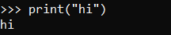
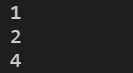
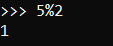
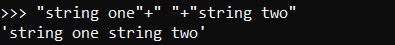
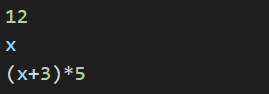
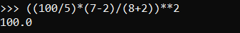
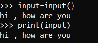
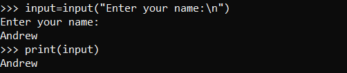

# _Variables, expressions, and statements_
+ #### Values and types  
A value is one of the basic things a program works with, like a letter or a number.  
Examples of values are 1, 3.14, and "Hello, World!"

These values belong to different types: **1** is an integer, **3.14** is an float, and **"Hello, World!"** is a string.

**Float&nbsp;&nbsp;&nbsp;&nbsp;:** Numbers which are represented in a format called floating point.  
**String&nbsp;&nbsp;&nbsp;:** Value which contain "string" of leters and enclosed in quotation marks.

**type** Statement can specify type of value  


>**Note:** any value enclosed in quotation mark is considered as string

***

## 1._Variables_
A variable is a name that refers to a value.

An assignment statement creates new variables and gives them values:  
  
This example makes three assignments. The first assigns a string to a new variable named **message**.  
the second assigns the integer 10 to **hour**. the third assigns the (approximate) value of π to **pi**.  

To display the value of a variable, you can use a print statement:  


The type of a variable is the type of the value it refers to:  


<br>

+ ### Variable names and keyword
Variable names can be arbitrarily long. They can contain both **letters** and **numbers**,  
but they cannot start with a number. It is legal to use uppercase letters,  
but it is a good idea to begin variable names with a lowercase letter.

The **underscore** character (_) can appear in a name. It is often used in names with multiple words,  
such as **my_name** or **time_at_start**. Variable names can start with an underscore character

If you give a variable an illegal name, you get a syntax error:  


Also some names are not allowed to use as variable names They are called **Keywords** The interpreter  
uses keywords to recognize the structure of the program, and they cannot be used as variable names.

>#### Python reserves 33 keywords:
>**and**&emsp;**del**&emsp;**from**&emsp;**None**&emsp;**True**&emsp;**as**&emsp;**elif**&emsp;**global**&emsp;**nonlocal**&emsp;**try**&emsp;**assert**  
>**else**&emsp;**if**&emsp;**not**&emsp;**while**&emsp;**break**&emsp;**except**&emsp;**import**&emsp;**or**&emsp;**with**&emsp;**class**&emsp;**False**  
>**in**&emsp;**pass**&emsp;**yield**&emsp;**continue**&emsp;**finally**&emsp;**is**&emsp;**raise**&emsp;**def**&emsp;**for**&emsp;**lambda**&emsp;**return**
  
***


## 2. _Statements_  
A statement is a unit of code that the Python interpreter can execute

When you type a statement in interactive mode, the interpreter executes it and displays the result,  
if there is one.  


A script usually contains a sequence of statements. If there is more than one statement,  
the results appear one at a time as the statements execute.  
For example, the script:  


Produces the output:  



>**Note:** Assignment statement produces no output

***
## 3. _Operators and operands_
Operators are special symbols that represent computations like addition and multiplication.  
The values the operator is applied to are called operands.  
Operator|Operation|Example
--------|---------|-------
`+`|Addition|```20+3```
`-`|Subtraction|```hour-1```
`*`|Multiplication|```hour*60```
`/`|Divition|```minite/60```
`**`|Exponentiation|```2**5```

+ Modulus operator  
The modulus operator works on integers and yields the remainder when the first  
operand is divided by the second  
Example:  


+ String operations  
The + operator works with strings, but it is not addition in the mathematical sense.  
Instead it performs concatenation, which means joining the strings by linking them  
end to end.  
Example:  



> Note:There has been a change in the division operator between Python 2.x and Python 3.x. In Python 3.x, the result of this division is a floating point result:
>```python
> >>> minute = 59
> >>> minute/60
> 0.9833333333333333
>```
> The division operator in Python 2.0 would divide two integers and truncate the
result to an integer:
>```python
> >>> minute = 59
> >>> minute/60
> 0
>```
> To obtain the same answer in Python 3.0 use floored ( // integer) division.
>```python
> >>> minute = 59
> >>> minute//60
> 0
>```  

***
## _4. Expressions_
An expression is a combination of values, variables, and operators.  
A value all by itself is considered an expression, and so is a variable

Examples:  


If you type an expression in interactive mode, the interpreter evaluates it and displays the result:  


>**Note:** In a script expression all by itself doesn't do anything

***

## _4. Order of operations_
When more than one operator appears in an expression, the order of evaluation depends on  
the rules of precedence. For mathematical operators, Python follows mathematical convention.  

+ Parentheses have the highest precedence and can be used to force an expression to evaluate  
in the order you want. 
+ Exponentiation has the next highest precedence.
+ Multiplication and Division have the same precedence i.e third precedence.
+ Addition and Subtraction have the least precedence.
+ Operators with the same precedence are evaluated from left to right

***
## _4.Acquiring input from user_
Python provides a built-in function called input that gets input from  the keyboard.  
When this function is called, the program stops and waits for the user to type something.  
When the user presses Return or Enter, the program resumes and input returns what the  
user typed as a string.  



Before getting input from the user, it is a good idea to print a prompt telling the user  
what to input.  


>**Note:** The sequence \n at the end of the prompt represents a newline.which is a special character that causes a line break.

If you expect the user to type an integer, you can try to convert the return value to  
int using the int() function:  


>**Note:** Using other then string containing only numbers on **int()** function will get you an error

***

## _5.Comments_
Comments are notes to the program to explain it in natural language.  
They dont interfere with the execution of program.

In python comments start with **#** symbol  
```python
# compute the percentage of the hour that has elapsed
percentage = (minute * 100) / 60
```
comments can also be placed at the end of lines
```python
percentage = (minute * 100) / 60 # percentage of an hour
```

Comments are most useful when they document non-obvious features of the code.  
It is reasonable to assume that the reader can figure out what the code does;  
it is much more useful to explain why

This comment is redundant with the code and useless:  
```python
v = 5       # assign 5 to v
```

This comment contains useful information that is not in the code:  
```python
v = 5       # velocity in meters/second.

```
***

## _6.Choosing mnemonic variable names_
As long as you follow the simple rules of variable naming, and avoid reserved words,  
you have a lot of choice when you name your variables. In the beginning, this choice can  
be confusing both when you read a program and when you write your own programs

Example:  
```python
#Example 1
a = 35.0
b = 12.50
c = a * b
print(c)

#Example 2
hours = 35.0
rate = 12.50
pay = hours * rate
print(pay)

#Example 3
x1q3z9ahd = 35.0
x1q3z9afd = 12.50
x1q3p9afd = x1q3z9ahd * x1q3z9afd
print(x1q3p9afd)
```
The Python interpreter sees all three of these programs as exactly the same but humans  
see and understand these programs quite differently. Humans will most quickly understand  
the intent of the second program because the programmer has chosen variable names that  
reflect their intent regarding what data will be stored in each variable.

***

## Exercises
1. Write a program that uses input to prompt a user for their name and then welcomes them.  
```python
name=input("Enter your name :")
print("Hello "+name)
```
2. Write a program to prompt the user for hours and rate per hour to compute gross pay.
```python
hour=int(input("Enter Hours: "))
rate=int(input("Enter Rate: "))
pay=hur*rate
print(pay)
```
3. sdv